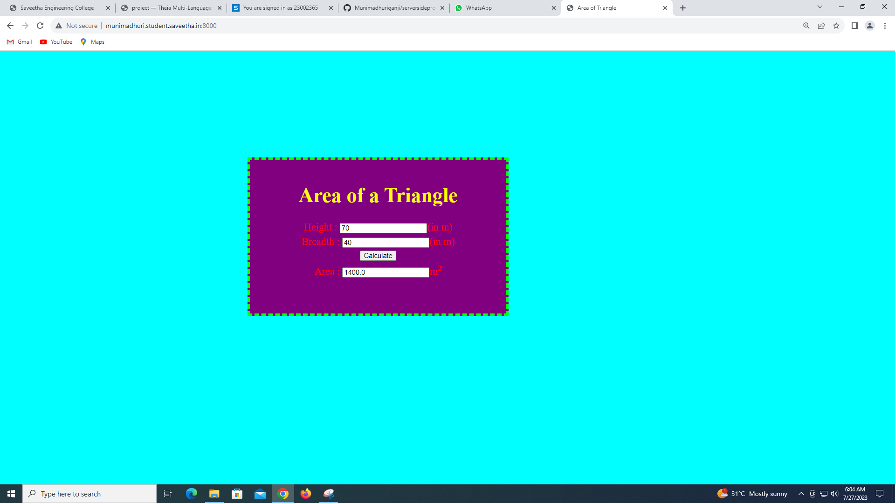

# Design a Website for Server Side Processing

## AIM:
To design a website to perform mathematical calculations in server side.

## DESIGN STEPS:

### Step 1:
create a folder ex05 under unit3 folder, and clone the forked github repository into ex05.
In the folder 'serversideprocessing'create a django project titled 'myproj'. 

### Step 2:
inside the 'myproj' folder, create an app called 'myapp'. 
Inside 'myapp', create a folder called 'templates'.

### Step 3:
under 'templates', create another folder titiled 'myapp' under which the html file 'math.html' should be created.
write the html code for creating the webpage in 'math.html'.

### Step 4:
Add the line 'import os' and update ALLOWED_HOSTS and INSTALLED_APPS IN SETTINGS.PY.


### Step 5:
update the codes in views.py and urls.py to execute the webpage.

### Step 6:
Publish the website in the given URL.

## PROGRAM :
### maths.html:
```html
<html>
<head>
<meta charset='utf-8'>
<meta http-equiv='X-UA-Compatible' content='IE=edge'>
<title>Area of Triangle</title>
<meta name='viewport' content='width=device-width, initial-scale=1'>
<style type="text/css">
body 
{
background-color:cyan;
}
.edge {
width: 1080px;
margin-left: auto;
margin-right: auto;
padding-top: 200px;
padding-left: 300px;
}
.box {
display:block;
border: Thick dashed lime;
width: 500px;
min-height: 300px;
font-size: 20px;
background-color: purple;
}
.formelt{
color: Red;
text-align: center;
margin-top: 5px;
margin-bottom: 5px;
}
h1
{
color: yellow;
text-align: center;
padding-top: 20px;
}
</style>
</head>
<body>
<div class="edge">
<div class="box">
<h1>Area of a Triangle</h1>
<form method="POST">

<div class="formelt">
Height : <input type="text" name="height" value="{{h}}"></input>(in m)<br/>
</div>
<div class="formelt">
Breadth : <input type="text" name="breadth" value="{{b}}"></input>(in m)<br/>
</div>
<div class="formelt">
<input type="submit" value="Calculate"></input><br/>
</div>
<div class="formelt">
Area : <input type="text" name="area" value="{{area}}"></input>m<sup>2</sup><br/>
</div>
</form>
</div>
</div>
</body>
</html>
```
### views.py:
```py
from django.shortcuts import render
from django.template  import loader
from django.shortcuts import render
# Create your views here.


def triarea(request):
    context={}
    context['area'] = "0"
    context['h'] = "0"
    context['b'] = "0"
    if request.method == 'POST':
        print("POST method is used")
        h = request.POST.get('height','0')
        b = request.POST.get('breadth','0')
        print('request=',request)
        print('Height=',h)
        print('Breadth=',b)
        area = 0.5 * int(h) * int(b)
        context['area'] = area
        context['h'] = h
        context['b'] = b
        print('Area=',area)
    return render(request,'myapp/math.html',context)
```
### urls.py:
```py
from django.contrib import admin
from django.urls import path
from myapp import views
urlpatterns = [
    path('admin/', admin.site.urls),
    path('areaoftriangle/',views.triarea,name="areaoftriangle"),
    path('',views.triarea,name="areaoftriangleroot")
]
## OUTPUT:

### HomePage:


### output1:


### output2:


## Result:
  this programe is executed succesfully.
